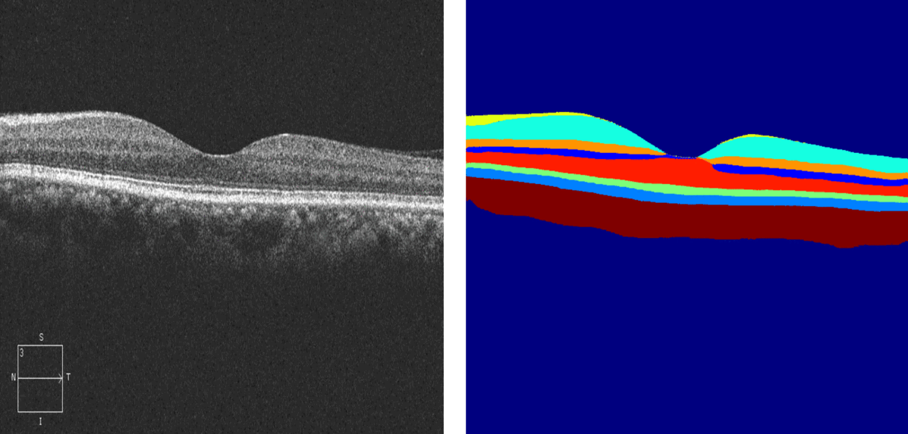
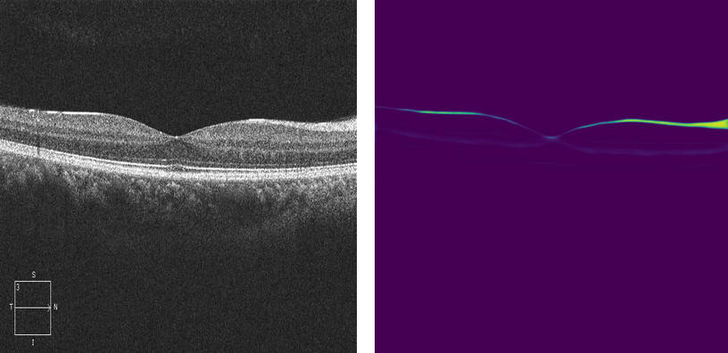

# Introduction

These instructions give steps to setup and to train models that 
segment Optical Coherence Tomography (OCT) into layers and 
introduce augmentations (changes) into those layers.

# Concepts
The machine learning, computer vision, deep learning based approach is used to segement retina layers on Optical Coherence Tomogrpahy images. 

Segmentation of retinal layers on OCT images is important because it gives the ability to utilize the image in many different use cases which often depend on the height of each layer in the image. Properly segmentating each layer greatly facilitates the visual observations. 

## Retinal Image and OCT Layers

- NFL - nerve fiber layer
- GCL+IPL - ganglion cell layer, inner plexiform layer
- INL - inner nuclear layer
- OPL - outer plexiform layer
- ONL - outer nuclear layer
- Ellipsoid zone
- RPE - retinal pigment epithelium
- Choroid


](structure_normal_retina.png)




## Dataset

[Original Dataset](<https://dataverse.scholarsportal.info/dataset.xhtml?persistentId=doi:10.5683/SP/WLW4ZT> "Optional title") is publicly available. It is OCT Image Database (OCTID) of
University of Waterloo, 2018 year. There is a fovea-centered OCT image of 25
healthy patients. Size 750 x 500 pixels, grayscale images.

[Labeled Dataset](< https://drive.google.com/file/d/1mZRxoPUn6eKbYrPi8jXua-nGhEftd1qa/view?usp=share_link/>) images in dataset where 'X' is the image,'Y' is the mask or ground truth.
The images were segmented manually by using [makesense.ai](<https://www.makesense.ai/>).

[Manual Segmentation](https://borealisdata.ca/dataset.xhtml?persistentId=doi:10.5683/SP/UIOXXK)

[Manual Segmentation Tool](https://www.mathworks.com/matlabcentral/fileexchange/66873-octseg-optical-coherence-tomography-segmentation-and-evaluation-gu)

# Segmentation Algorithm

Segmentation Algorithm minimizes an energy function that incorporates gradient information and local smoothing terms, ensuring accurate boundary detection of the retinal nerve fiber layer (RNFL). Robustness to Image Quality: A significant advantage of this method is its resilience to variations in image quality, making it reliable across different scanning conditions.

# Architecture
 
UNet is a Convultional Neural Network (CNN) specially designed for image segmentation in different cases, but originally, for biomedical images. It is designed to identify not only bold obvious border lines, but also thin barely noticeable lines. Because of this reason, originally UNet was designed for biomedical images, where one could segment vessels on eye images for example and so on. It is a sequence of convolutions that decreases image size and upsample it again by adding additional info from corresponding previous layer. Because of this reason it is called UNet, this type of processesing creates a U shaped architecture. Refer to the following detailed UNet architecture which is used in the project:


The algorithm takes a grayscale image with 640x640x1 as an input and outputs an 640x640x9 image.
ReLu is used as an activation function.  Each layer in the output image is a retinal layer in the OCT image.  Validation metrics such as a simple accuracy from the keras.models library is used.



# Validation Metrics

## IoU (Intersection over Union)
IoU is a common evaluation metric for semantic image segmentation. Mean IoU of the algorithm is 75.4%. 

## Accuracy - Loss
Final value of accuracy - 96.45%, loss - 0.1016 (decreased from 2.01).


# Program Design

This is jupyter-notebook for converting JSON files with coordinates to segmented masks of original OCT images. For segmenting I used [makesense.ai](<https://www.makesense.ai/>) tool. As result it gives in type of VGG JSON. </br>:hammer_and_wrench: Variables that should be changed:
* *json_file* - local path to VGG JSON file
* *original_images* - local path to original OCT images
* *result_save* - local path to store result images -segmented masks
* *class_dict* - your label names in VGG JSON (segmentation classes)

It is python file that contain UNet architecture model as class. This class we will use in the main segmentation file.

It is jupyter-notebook file that contain main part of segmentation algorithm.</br> :hammer_and_wrench: Variables that should be changed:
* *TRAIN_PATH_X* - local path to original OCT images (X-label)
* *TRAIN_PATH_Y* - local path to segmeted OCT imaes, maskes (Y-label)
* *n_classe* - number of classes for segmentation
* *SIZE_X* - width of image (optional, default 640 pixels)
* *SIZE_Y* - height of image (optional, default 640 pixels)

# Checkpoints

 [Pre-trained Model](https://drive.google.com/drive/folders/1zKkv0BsFAHi2BV7oUBiD8FRK_HDMaViE?usp=sharing) can be downloaded and used directly. Its already contained trained weights for OCTID dataset.

# Prerequisites

- Compute node with GPU has alredy been created and running.
- Be sure to set a 15 idle timeout.

# Setup environment

Run the following commands to setup a python virtual env.

```
python -m venv .venv
pip install virtualenv
[windows].venv\Scripts\activate
[linux]source .venv/bin/activate
pip install -r requirements.txt
```

## Download images

Before training, images need to downloaded from a storage account onto the compute instance.
```
az storage blob download-batch \
    --account-name $STORAGE_ACCOUNT \
    --source $CONTAINER_NAME \
    --destination $DESTINATION_DIR \
    --pattern "$FOLDER_PREFIX*" \
    --account-key $ACCOUNT_KEY
```

# Training and Testing

1.  Training. Configure and run `set TORCH_USE_CUDA_DSA=1 && python train.py`.

2.  Testing. Configure and run `set TORCH_USE_CUDA_DSA=1 && python test.py`.

# Upload images

After each training, images in training_progress can be uploaded to a storage account to be downloaded and viewed.
```
az storage blob upload \
    --account-name $STORAGE_ACCOUNT \
    --container-name $CONTAINER_NAME \
    --name file.png \
    --file ./file.png \
    --account-key $ACCOUNT_KEY
```

# Reference(s)

[Compute Instance](https://learn.microsoft.com/en-us/azure/machine-learning/concept-compute-instance?view=azureml-api-2)

[Memory-efficient High-resolution OCT Volume Synthesis with Cascaded Amortized Latent Diffusion Models](https://arxiv.org/pdf/2405.16516)
